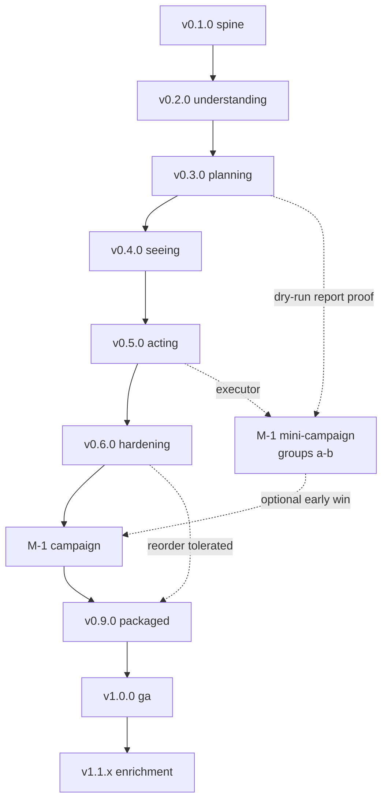

# Audiobook Organizer - Program Roadmap

This is the cross-release execution ledger: the tracked map of what ships in what order, why, and under which gates. It formalizes the planning draft `_local/planning/release-plan-and-ci_2026-07-02.md` (release plan and CI). Per D-12 (docs/internal tracked in git) and FD-16 (effort = release), this roadmap plus the per-release folders under `docs/internal/releases/` are the governance source of truth. The planning draft remains as history; see the Supersession note at the end.

The load-bearing content is in the tables and the dependency graph. Acceptance criteria are NOT authored here: they live in each release folder's `spec.md` (standing rule 4). This document aggregates and references them.

## 1. Ratified decisions ledger

One-liners with ratification dates. Deep rationale lives in the PRD (`docs/internal/product-requirements.md`) and in the MADR records under `docs/internal/decisions/`. Every decision is jp-ratified; do not relitigate.

| ID | Decision (handle) | Date | Deep rationale |
|---|---|---|---|
| D-01 | Stack locked to repo-sync common stack (Tauri v2, Rust, React, TS, shadcn/ui, SQLite via sqlx, tauri-specta) | 2026-07-02 | ADR [0001 (stack locked)](decisions/0001-stack-locked-to-common-stack.md) |
| D-02 | Default layout author-first (`abs-author-first` preset); genre and awards are tags/collections, never folders | 2026-07-03 | ADR [0005 (author-first layout)](decisions/0005-author-first-default-layout.md) |
| D-03 | Audience is all three tiers; tier 2 (family) sets the UI bar (no paths/exit codes/jargon as primary interface) | 2026-07-03 | ADR [0006 (family tier sets UI bar)](decisions/0006-family-tier-sets-ui-bar.md) |
| D-04 | Milestone posture: early mini-campaign; a full dry run with browsable confirmation AND exportable HTML report (F-506) before anything executes | 2026-07-03 | ADR [0007 (dry-run report first-class)](decisions/0007-dry-run-report-first-class.md) |
| D-05 | Look and feel: two sanctioned moods of one design system (warm evening library + calm daytime utility) as themes | 2026-07-03 | `docs/internal/design-system.md` |
| D-06 | Anti-reference: the AI-dashboard look is banned; covers are square 1:1, no fake spine shading (series clusters keep the spine metaphor) | 2026-07-03 | `docs/internal/design-system.md`; PRODUCT.md |
| D-07 | Engine-first build order: abo-core hardens on fixtures before any GUI; GUI renders a frozen tauri-specta contract | 2026-07-02 | ADR [0002 (engine-first order)](decisions/0002-engine-first-build-order.md) |
| D-08 | Rename-first executor: same-volume rename primary; copy+verify+delete cross-volume only; the feasible full copy is a pre-campaign backup, not the apply mechanism | 2026-07-02 | ADR [0003 (rename-first executor)](decisions/0003-rename-first-executor.md) |
| D-09 | Safety invariants: quarantine-only, journal-before-act, single-writer, Vfs seam, rollback-is-a-plan, never-overwrite | 2026-07-02 | ADR [0004 (safety invariants)](decisions/0004-safety-invariants-quarantine-journal-single-writer.md) |
| D-10 | Scope of "go": after jp approves the executive summary, execute the full ladder; hard stops only at human-only gates | 2026-07-03 | `EXECUTION.md` |
| D-11 | Remote: existing private repo; trunk-based, short-lived branches, PRs, agent self-merges green PRs while private; CI substitutes for code review | 2026-07-03 | `EXECUTION.md` |
| D-12 | `docs/internal/` is tracked in git; only `_local/`, `.memsearch/`, tool caches are gitignored | 2026-07-03 | ADR [0008 (docs-internal tracked)](decisions/0008-docs-internal-tracked.md) |
| D-13 | OSS posture: private now; license and public flip decided at v0.9.0 (human-only); docs written public-ready | 2026-07-03 | ADR [0014 (offline-first, unsigned-until-public)](decisions/0014-offline-first-no-update-no-telemetry.md) |
| D-14 | Pack/award provenance captured in v1 as durable data plus an exported report; ABS-side push (collections) deferred to v1.1+ | 2026-07-03 | ADR [0010 (provenance captured in v1)](decisions/0010-provenance-captured-in-v1.md) |
| D-15 | Cover extraction commits to v0.4.0 (embedded art + cover.jpg sidecar, read-only) with a designed no-cover fallback tile | 2026-07-03 | ADR [0012 (covers committed v0.4.0)](decisions/0012-covers-committed-v0.4.0.md) |
| D-16 | Review surface: per-group cards with curated examples plus the full HTML report is the P0 product; the exhaustive everything view is P1, later | 2026-07-03 | ADR [0011 (cards and report over tree diff)](decisions/0011-cards-and-report-over-tree-diff.md) |
| D-17 | Pre-campaign backup posture is user-defined; the product and M-1 runbook present options with trade-offs; nothing Real runs without a recorded backup decision | 2026-07-03 | ADR [0013 (backup posture user-defined)](decisions/0013-backup-posture-user-defined.md) |

The FD-nn content decisions (FD-01..FD-30, orchestrator fixes to audit findings) live in `docs/internal/decision-ledger.md` and are applied throughout this suite. This roadmap references them by ID where they change scope; see the Scope ledger (Section 4).

## 2. Release ladder

Codenames and gates inherit from the release plan Section 3, updated for the five new features (F-507, F-608, F-907, F-908, F-909), the F-501 redefinition (FD-06), and the F-506 P0 elevation (D-04). Feature scope is by ID + handle. Each version links to its release folder.

| Release | Codename | Theme | Primary scope (ID + handle) | Gate (one line) |
|---|---|---|---|---|
| [v0.1.0](releases/v0.1.0-spine/spec.md) | spine | Scaffold + tracer bullet | F-101 (live tree scanner), F-103 (file typing), F-105 (snapshot persistence), F-1003 (structured logging); throwaway UI; hygiene set (FD-25), live CI (FD-24), Tauri capability model (FD-29) | Tracer slice end-to-end on Windows; CI matrix green |
| [v0.2.0](releases/v0.2.0-understanding/spec.md) | understanding | Scan + classify + parse | F-102 (WizTree CSV import), F-104 (job progress + cancel), F-201 (folder classification), F-202 (health metrics), F-203 (multi-book detection), F-301 (pattern matchers), F-302 (noise strippers), F-303 (field extraction), F-304 (name normalizer), F-1001 (activity log); fixture harness; tag-quality probe (FD-14); video class (FD-17) | Fixture library classifies and parses to golden expectations |
| [v0.3.0](releases/v0.3.0-planning/spec.md) | planning | Plans, validation, exports | F-401 (naming templates), F-402 (structure policies), F-403 (plan builder), F-404 (plan validation), F-405 (plan persistence), F-505 (plan export), F-506 (dry-run HTML report, P0), F-507 (pack provenance capture, new), F-701 (duplicate candidates), F-801 (ruleset model), F-1002 (reports folder), F-204 (disc detection), F-205 (parallel-format detection) | Deterministic validated plan over fixtures + real snapshot; HTML dry-run report readable by a non-engineer |
| [v0.4.0](releases/v0.4.0-seeing/spec.md) | seeing | GUI over the frozen seam | F-901 (app shell), F-902 (library home, renamed FD-07), F-903 (plan preview) hosting F-502 (group review), F-503 (search/filter), F-504 (explainability); F-906 (settings + ruleset editor), F-803 (app settings); F-907 (cover extraction + fallback, new), F-908 (error/empty/loading states, new), F-909 (first-run + root selection, new); Stop controls on progress (FD-02) | Human reviews and approves a real-library plan in the app |
| [v0.5.0](releases/v0.5.0-acting/spec.md) | acting | Executor + rollback (alpha) | F-601 (executor), F-602 (journal + undo manifest), F-603 (rollback), F-604 (post-apply verification), F-605 (quarantine), F-607 (dry-run harness), F-608 (pause and resume apply, new), F-904 (apply + activity surface); F-507 (provenance) journal/manifest carry-through | Rollback round-trip green on fixtures AND on a real-data copy |
| [v0.6.0](releases/v0.6.0-hardening/spec.md) | hardening | Interruption, dedupe, polish | F-606 (interruption safety + resume), F-702 (hash verification), F-703 (duplicate review + report), F-704 (resolution policies), F-802 (ruleset import/export), F-905 (duplicates surface), F-501 (everything view, redefined FD-06) | Kill-during-apply reconciles; hash-verified dedupe on copies |
| [M-1](releases/M-1-campaign/runbook.md) | campaign | The real-library reorganization | Operational milestone, not a software version; runs on v0.6.x (or v0.5.x for the mini-campaign) | Library clean per health metrics; ABS imports correctly; backup decision recorded (D-17) |
| [v0.9.0](releases/v0.9.0-packaged/spec.md) | packaged | Distribution + docs (beta) | NSIS/MSI artifact (unsigned per FD-22), README + user docs, onboarding polish, fresh-machine install path | Fresh-machine install runs a full pipeline on a sample tree |
| v1.0.0 (folder not yet scaffolded) | ga | Windows GA | Stabilization only; no new scope; schema freeze | All gates re-verified; tag cut by human |
| v1.1.x (folder not yet scaffolded) | enrichment | Deferred value | F-1101 (embedded tag reader), F-1102 (ABS API integration + provenance push per D-14), F-1105 (intake mode) | Per-feature spec |

Notes carried from the FD ledger: F-902 is "library home", never "dashboard" (FD-07); the word dashboard does not appear on user-facing surfaces. F-501 in v0.6.0 is the redefined "everything view" (virtualized full change list, tree optional), NOT the old P0 tree-diff (FD-06). The seven campaign groups (FD-26) are canonical for the review UI and report.

## 3. Dependency graph

Edge semantics: a solid arrow is strictly linear (the downstream release cannot start until the upstream release is complete and its gate is green). The dashed edge marks tolerated reordering. The dotted branch marks the early mini-campaign option (D-04): campaign groups (a) loose-root-books and (b) strip-noise can run against v0.5.x, consuming the v0.3.0 dry-run report as proof, before the full ladder finishes.

Reading the graph:
- Strictly linear through v0.5.0 (acting): each release hardens the data or contract the next consumes. The executor (v0.5.0) must not land before two full releases of parsing and planning have proven the plan it applies (D-07 engine-first).
- v0.6.0 (hardening) and v0.9.0 (packaged) tolerate reordering if the campaign is urgent: hardening polish can trail a packaged beta, or vice versa. This is the only sanctioned reordering.
- M-1 (campaign) consumes proof, it does not produce software. The full campaign gates on v0.6.0. The mini-campaign is a first-class early path: groups (a)-(b) are the highest-value, lowest-risk groups and can run on v0.5.x once the dry-run report (v0.3.0) and executor (v0.5.0) exist.
- Every Real (non-dry-run) apply against the actual library is a human-only gate (D-10), regardless of position in the graph.

What each rung consumes from its predecessor and proves for its successor (the reason the spine is strictly linear):

| Release | Consumes | Proves for the next rung |
|---|---|---|
| v0.1.0 spine | nothing (scaffold) | The architecture holds end-to-end on Windows; the tauri-specta seam and schema exist |
| v0.2.0 understanding | the snapshot schema | The tool tells the truth about a library: classes and parsed fields are golden-stable |
| v0.3.0 planning | classifications + parses | A plan is deterministic, validated, and reviewable as files (report + exports) before any GUI |
| v0.4.0 seeing | the frozen plan contract | A human can review and approve a real-library plan; no new engine capability is needed |
| v0.5.0 acting | an approved plan | Apply and undo are byte-safe: the rollback round-trip is green on fixtures and real-data copies |
| v0.6.0 hardening | the executor + journal | The executor survives crashes, cancellation, pause/resume, and dedupe on real-data copies |

The enrichment order (v1.1.x) is deliberate, not alphabetical: F-1101 (embedded tag reader) first, because it directly raises parse confidence, the engine's weakest signal; then F-1102 (ABS API integration), which also carries the deferred provenance push (D-14); then F-1105 (intake mode) only after the product-posture decision (strategy brief, open question 4). Each enters through its own spec, not through this roadmap.

## 4. Scope ledger

What moved in or out of scope during this planning suite, and why.

| Change | Direction | Landing | Rationale |
|---|---|---|---|
| F-507 (pack provenance capture and report) | IN (new) | v0.3.0 capture + report; v0.5.0 journal/manifest carry-through | Provenance (Hugo, Nebula, Top 100, Dune Universe) was destroyed at flatten time (v1) while capture was deferred to v1.1. D-14 + FD-01 close the hazard: capture is durable data at plan time plus an exported report. |
| F-608 (pause and resume apply) | IN (new) | v0.5.0 | The prototype's "Pause between books" control had no backing feature (FD-02). Pause takes effect between operations only; journal unaffected. |
| F-907 (cover extraction and fallback tiles) | IN (new) | v0.4.0 | The cover-forward UI depended on the deferred F-1101 subset. D-15 + FD-03 pull a read-only lofty subset forward so the shelf shows real covers, with a deterministic colored fallback tile. |
| F-908 (error, empty, and loading states) | IN (new) | v0.4.0 | The prototypes are happy-path only (planning audit stream 2 item 1, docs/internal/planning-audit-2026-07-03.md). FD-04 makes every AppError family and every empty/edge/loading state a designed surface with AC. |
| F-909 (first-run and library root selection) | IN (new) | v0.4.0 | No first-run or ruleset surface existed; Settings was a dead link (audit stream 2 item 2). FD-05 adds onboarding via tauri-plugin-dialog; frontend never touches the filesystem. |
| F-501 (before/after tree diff) | REDEFINED | moved P0 v0.4.0 to P1 v0.6.0 | The prototypes settled on cards + report, not a tree diff (D-16). FD-06 redefines F-501 as the "everything view" (virtualized full change list, tree optional), a tier-1 disclosure surface in a later release. |
| F-506 (dry-run HTML report) | ELEVATED | P0, v0.3.0 | jp elevated F-506 from P1 to P0 on 2026-07-03 (D-04). The report is the review artifact for the early mini-campaign and must exist before any GUI. |
| F-902 (library home) | RENAMED | v0.4.0 | Renamed from "dashboard" (FD-07) to conform to the anti-reference (D-06). No stat bands, no hero metrics; health facts inside sentences. |
| Provenance ABS-side push | SPLIT / DEFERRED | v1.1+ (F-1102) | Capture lands in v1 (F-507); pushing award/pack membership as ABS collections stays deferred (D-14). No v1 copy promises ABS-side changes (FD-12). |
| Tag-quality probe | IN (gate item) | v0.2.0 | The folder-first assumption was unmeasured (FD-14). A bounded read-only probe on real files reports field completeness and validates the default. |
| Video/course/comic classification | IN (behavior) | v0.2.0 | Video (mp4 video, cbr/cbz comics) and course content were typed as audio (FD-17). Folders dominated by video/course route to manual-review, never auto-planned. |
| Seven canonical campaign groups | CLARIFIED | v0.3.0 review UI + report | The prototype UI (7 groups) and F-403's internal list (8) disagreed. FD-26 fixes seven user-facing groups; series-index normalization folds into "messy names" for the UI while staying a distinct internal plan pass. |
| F-506 report format completion | IN (scope) | v0.3.0 | The report promised a complete change list it did not include and diverged from the app type system (FD-28). The format spec adds the full change-list table, a report-only light "paper" theme, print rules, and the FD-10 guarantee block. |
| Bundled fonts, zero network | IN (constraint) | v0.1.0 app + v0.3.0 report | The prototypes' Google Fonts `<link>` violated zero-network (FD-11). Literata is bundled self-hosted in-app; the report embeds a subsetted Literata as a data URI. A CI grep gate greps for external hosts. |
| 2026-03-25 drift-tolerant baselines | IN (gate item) | v0.2.0 | Codex ABS-item baselines (~582 book-like, ~11 mixed, ~831 ABS items) plus noise counts were dropped from gates (FD-18). They return as drift-tolerant gate targets, every citation labeled "2026-03-25 baseline, pending fresh scan". |

## 5. Consolidated descope triggers

Carried from the release plan Section 5 where still valid. Each is a pre-agreed cut, decided now, so slippage produces a principled decision rather than a silent slide.

| Trigger condition | Pre-agreed action |
|---|---|
| macOS bundle red in CI > 1 week during any release | Downgrade macOS job to allow-fail + tracking issue; never block a Windows release on it |
| F-501 (everything view) unstable at end of its v0.6.0 window | Ship the grouped, virtualized list only; defer the optional tree presentation to a later release. The approval workflow, not the tree drawing, is load-bearing. |
| Parser fixture coverage < ~90% during v0.2.0 | Freeze the pattern set; remainder becomes `manual-review` by design (not a failure) |
| Hash performance unacceptable on real data in v0.6.0 | Campaign runs dedupe as flag-only; quarantine-by-hash becomes post-campaign work |
| Any executor invariant test flaky | Release freezes until deflaked; this is the one place slippage is accepted rather than descoped |
| Campaign groups (c)-(e) tooling not ready when library pain peaks | Run groups (a)-(b) as the early mini-campaign on v0.5.x (D-04); they are the highest-value, lowest-risk groups |

Not descopeable: the FD-24 CI hardening items (concurrency block with cancel-in-progress, `permissions: contents: read`, LTO profiles, bindings-drift gate placement) are safety and hygiene gates, not features. They are not subject to descope. Likewise the D-09 safety invariants and the rollback round-trip gate (v0.5.0 signature gate) never descope.

## 6. M-1 campaign sequence

The campaign (M-1) is an operational milestone, not a software version. It consumes proof produced by the software releases; it produces no code. The full protocol lives in `docs/internal/releases/M-1-campaign/runbook.md`. The staged group order below mirrors the discovery migration order, safest-and-highest-value first. Each Real apply is a human-only gate (D-10), each is preceded by a dry run and a read HTML report, and each is followed by a verification report and an ABS spot-check before the next group runs.

| Order | Campaign group | Why here | Earliest tooling |
|---|---|---|---|
| (a) | loose-root-books | 237 clean parses (2026-03-25 baseline); the safest big win | v0.5.x (mini-campaign, D-04) |
| (b) | strip-noise (renames) | High volume, low risk; same-volume renames only | v0.5.x (mini-campaign, D-04) |
| (c) | split-multi-book | Harder: Narnia/Harry Potter style multi-book folders | v0.6.x |
| (d) | flatten-packs | Flatten Hugo/Nebula/Top 100 packs into canonical book folders; provenance captured first (F-507) | v0.6.x |
| (e) | normalize-series + disc structures | Series index and disc-folder normalization | v0.6.x |
| (f) | dedupe-quarantine | Requires hash verification (F-702); losers set aside, never deleted | v0.6.x |
| (g) | empty-folder cleanup | `rmdir-empty` only on verified-empty dirs; last, after moves settle | v0.6.x |

Preconditions before any group runs: a recorded backup decision (D-17), a fresh scan (the 2026-03-25 snapshot is stale by definition), and a Windows/Defender pre-campaign check (FD-19). ABS cutover points at the canonical `Library` root as a new ABS library (avoiding ABS moved-item duplication heuristics), verifies author/series/sequence on a sampled shelf, then retires the old entry. The mini-campaign path (groups a-b on v0.5.x) is first-class per D-04: it does not require the full v0.6.0 hardening set.

## 7. Release gate model

Each release tags only when its composite gate (Section 2, detailed as AC in the release folder's `spec.md`) is green. The adapted six-gate ceremony (G0 scope-frozen through G4 tag-cut) is defined in the governance docs under `docs/internal/release-plans/` and referenced from `EXECUTION.md`; this roadmap carries the one-line gate per rung and defers the ceremony mechanics there (audit stream 3 item 2, governance-scaffolding). Evidence pointers for each gate follow the conventions in `docs/internal/test-strategy.md`. The rollback round-trip (v0.5.0 signature gate) runs in CI on every merge from v0.5.0 onward; it is the one gate that never descopes.

## 8. Effort tracking table

One row per release folder (FD-16: effort = release). Status is "planned" for all rows until execution starts. The Tracking issue column fills when GitHub issues exist (one issue per release, milestone = version).

| Version | Codename | Spec | Implementation plan | Status | Gate summary | Tracking issue |
|---|---|---|---|---|---|---|
| v0.1.0 | spine | [spec](releases/v0.1.0-spine/spec.md) | [plan](releases/v0.1.0-spine/implementation-plan.md) | built (gate walked 2026-07-04; tag awaiting jp per D-10) | Tracer slice end-to-end on Windows; CI matrix green; core-purity passes | PR #2 |
| v0.2.0 | understanding | [spec](releases/v0.2.0-understanding/spec.md) | [plan](releases/v0.2.0-understanding/implementation-plan.md) | built (gate walked 2026-07-04; tag awaiting jp per D-10) | Fixture classifies + parses to golden; strippers idempotent; real scan < 60 s | PRs #6, #7, #9, #10, #11, #13 |
| v0.3.0 | planning | [spec](releases/v0.3.0-planning/spec.md) | [plan](releases/v0.3.0-planning/implementation-plan.md) | built (gate walked 2026-07-05; G-6 non-engineer read pending jp; tag awaiting jp per D-10) | Deterministic validated plan; HTML report passes non-engineer read test | PRs #14, #15, #16 |
| v0.4.0 | seeing | [spec](releases/v0.4.0-seeing/spec.md) | [plan](releases/v0.4.0-seeing/implementation-plan.md) | planned | Human approves real-library plan in app; preview responsive over 718 folders | - |
| v0.5.0 | acting | [spec](releases/v0.5.0-acting/spec.md) | [plan](releases/v0.5.0-acting/implementation-plan.md) | planned | Rollback round-trip byte-identical on fixtures AND real-data copy | - |
| v0.6.0 | hardening | [spec](releases/v0.6.0-hardening/spec.md) | [plan](releases/v0.6.0-hardening/implementation-plan.md) | planned | Kill-during-apply reconciles both directions; hash-verified dedupe on copies | - |
| M-1 | campaign | [runbook](releases/M-1-campaign/runbook.md) | (runbook is the artifact) | planned | Health metrics near zero for target problems; ABS imports; backup recorded (D-17) | - |
| v0.9.0 | packaged | [spec](releases/v0.9.0-packaged/spec.md) | [plan](releases/v0.9.0-packaged/implementation-plan.md) | planned | Fresh-machine install runs full pipeline on a sample tree | - |
| v1.0.0 | ga | (folder not yet scaffolded) | (folder not yet scaffolded) | planned | All prior gates re-verified; schema frozen; tag cut by human | - |
| v1.1.x | enrichment | (folder not yet scaffolded) | (folder not yet scaffolded) | planned | Per-feature spec | - |

Release folders are scaffolded via `/jp-release-plan --create vX.Y.Z` when execution starts; specs own AC from that point. v1.0.0 and v1.1.x folders are created at their time (no spec authored in this suite).

## 9. Pre-v0.1.0 checklist

The build does not start until every item is recorded. This is the gate on beginning the spine.

- [x] FD-15 OSS-landscape timeboxed check: recorded 2026-07-03 in `docs/internal/oss-landscape-check.md`. Verdict: build justified (narrowly); no tool subsumes classify-plan-preview-apply-rollback over folder structure with quarantine and a family-safe desktop surface; borrow-list captured for later releases.
- [x] Prior-work rescue: `folder-structure.md` (jp's historical naming preference), regex recipes, and `WizTree_2026-03-25.csv` rescued to `_local/prior-work/` on 2026-07-03 (audit stream 1 item 2).
- [x] `.gitignore` and `.gitattributes` landed on the docs branch (FD-25), merged to main in PR #1 (2026-07-03): `.gitignore` ignores `_local/`, `.memsearch/`, and tool caches only (works on any machine); `.gitattributes` sets `* text=auto eol=lf` for byte-stable goldens.
- [x] `EXECUTION.md` ratified at repo root with the planning suite (PR #1 merged 2026-07-03).
- [x] Executive summary approved by jp ("go", 2026-07-03), authorizing the full ladder per D-10.

Note on CI timing (FD-24): live workflow files land in the v0.1.0 spine, NOT in this docs-only branch. A docs-only push must not create a red CI.

## 10. Timeline posture

Directional estimates from the release plan Section 7, restated with the trust-gates-not-numbers caveat. These size focused agent-driven effort, not calendar time, and are not a promise.

| Release | Focused effort |
|---|---|
| v0.1.0 (spine) | ~1 week |
| v0.2.0 (understanding) | ~1.5 weeks |
| v0.3.0 (planning) | ~1.5 weeks |
| v0.4.0 (seeing) | ~1.5 weeks |
| v0.5.0 (acting) | ~2 weeks |
| v0.6.0 (hardening) | ~1.5 weeks |
| M-1 (campaign) | ~1 week elapsed (mostly verification between groups) |
| v0.9.0 (packaged) | ~1 week |
| v1.0.0 (ga) | ~0.5 week |

Total ~11-12 focused weeks to GA, with genuinely useful artifacts far earlier: a reviewed reorganization plan plus a shareable HTML dry-run report at v0.3.0 (planning), a working review app at v0.4.0 (seeing), and the early mini-campaign option on v0.5.x. Trust the gates and the descope triggers, not the numbers. Per D-10, each version boundary produces a non-blocking release report; the report informs but does not gate the next release (only the human-only stops gate).

## 11. Supersession note

This roadmap plus the per-release folders under `docs/internal/releases/` supersede `_local/planning/release-plan-and-ci_2026-07-02.md` (release plan and CI) for governance. That draft remains in `_local/` as history and rationale; it is not deleted. Two specific corrections apply:

- D-12 (docs/internal tracked) corrects the release plan Section 2 line that said "any future `docs/internal/` stay quarantined from public history via `.gitignore`". Per the repo-sync convention, `docs/internal/` is tracked; only `_local/`, `.memsearch/`, and tool caches are gitignored. See ADR [0008 (docs-internal tracked)](decisions/0008-docs-internal-tracked.md).
- FD-16 (effort = release) replaces any E-NN effort/epic use for governance. Epics E-01..E-11 remain taxonomy inside the PRD and the feature-function breakdown only; no E-NN effort ids are used for tracking, avoiding collision with the repo-sync effort namespace.

When execution starts, this document is the map the jp-library ceremonies execute against (`/jp-init-project`, `/jp-spec`, `/jp-release-plan --create`). It is updated as releases complete rather than left to drift.
